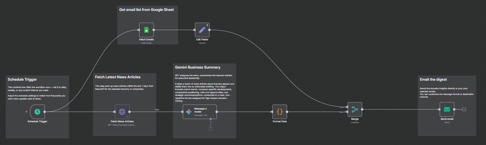

# Industry Digest — Skeleton (n8n → NewsAPI → Gemini → Email)

Zero-cost n8n + Gemini pipeline that lands a Monday-morning email distilling EPC wins, setbacks & macro trends in ~7 minutes.

## Why
New to EPC, I was burning ~3 hrs every weekend scanning 30+ sources and still missed early signals.

## What it does
- Schedules weekly run → fetches relevant EPC news (NewsAPI)
- Gemini clusters into **Wins / Setbacks / Strategy Moves / Macro**, pulls deal values, geos, keywords
- Formats as branded HTML → emails to a list from Google Sheets

## Run it yourself (5 steps)
1. Import `workflow/industry-digest.skeleton.json` into n8n.
2. Link **Google Sheets** (OAuth) and **SMTP/Gmail** credentials.
3. Create a Google Sheet with emails (any single column). Set env:
   - `INDUSTRY_SHEET_ID=<your-google-sheet-id>`
4. Set secrets/env in n8n:
   - `INDUSTRY_NEWSAPI_KEY=<your-newsapi-key>`
   - `INDUSTRY_FROM_EMAIL=<you@company.com>`
5. Adjust the **Schedule Trigger** and hit **Execute** for a test send.

## Notes
- The prompt returns **STRICT JSON**; a **Format Data** node turns it into safe, inline-styled HTML for email clients.
- To CC multiple recipients, add them to the Sheet; the Set node joins them into a comma-separated list.

## Portfolio summary
**Problem** — Weekly EPC scan took ~3 hrs; info scattered.  
**Action** — n8n schedule → NewsAPI fetch → Gemini summary (wins/setbacks/strategy/macro) → HTML formatter → SMTP send.  
**Result** — ~3 hrs → ~7 min; now also used to send a digest to senior leadership.  
**Learnings** — Scheduling without babysitting; prompt/JSON schema discipline; run cost vs frequency.

## License
MIT (see `LICENSE` if you add one).
